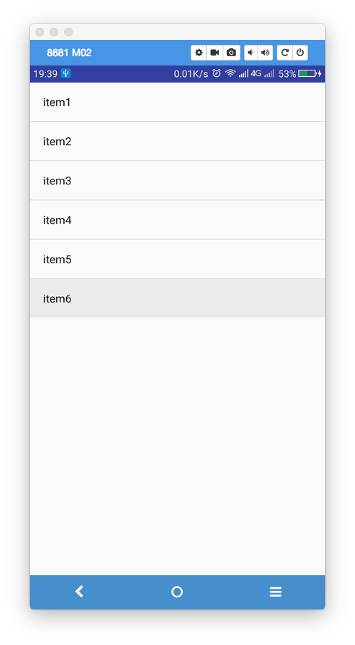
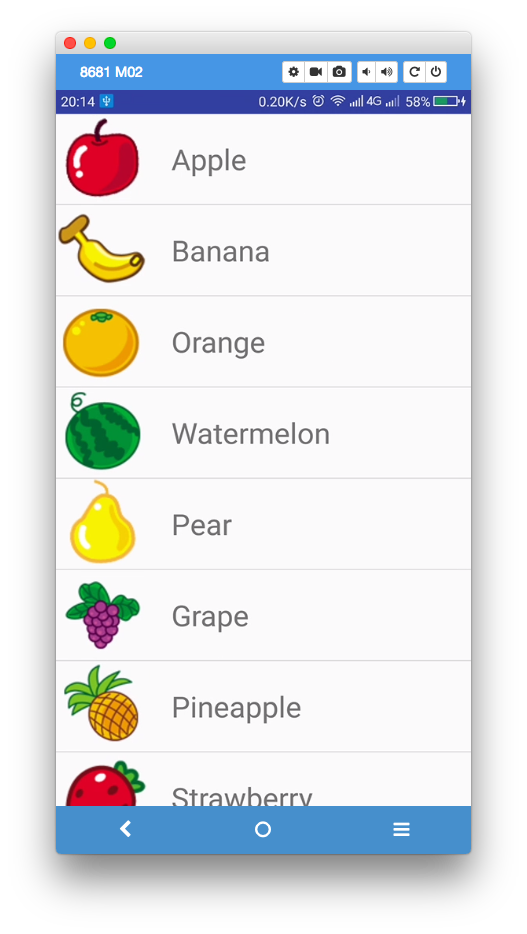
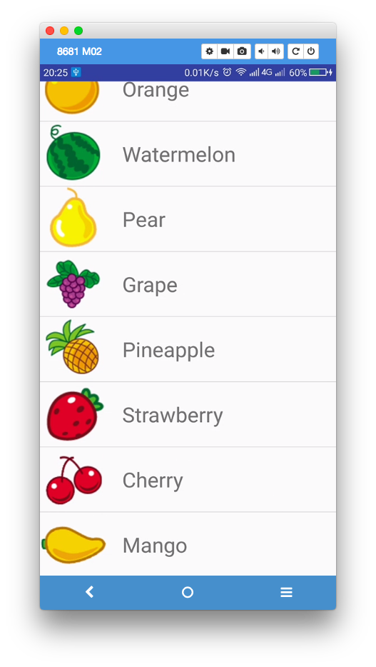

[TOC]
---

# 1. ListView 的简单用法

> 创建listview项目

>布局文件

```xml
    <ListView
          android:id="@+id/lv_list"
        android:layout_width="match_parent"
        android:layout_height="wrap_content">

    </ListView>
```


>MainActiviy
1. 设置数据
2. 初始化listview 对象
3. 创建Adapter
4. ListView设置Adapter


```java
    protected void onCreate(Bundle savedInstanceState) {
        super.onCreate(savedInstanceState);
        setContentView(R.layout.activity_main);
        //1. 
        String []data = {"item1","item2","item3","item4","item5","item6"};
        //2.
        ListView lv_list = (ListView) findViewById(R.id.lv_list);
        //3.
        ArrayAdapter<String> adapter = new ArrayAdapter<>(MainActivity.this,android.R.layout.simple_list_item_1,data);
        //4. 
        lv_list.setAdapter(adapter);
}
```

>效果

  

# 2. 自定义Adapter
## 2.1 设置数据对应的bean
>创建水果对应的bean对象

```java
public class Fruit {
    private  String name;
    private  int imageid;

    public Fruit() {
    }

    public Fruit(String name, int imageid) {
        this.name = name;
        this.imageid = imageid;
    }

    public String getName() {
        return name;
    }

    public void setName(String name) {
        this.name = name;
    }

    public int getImageid() {
        return imageid;
    }

    public void setImageid(int imageid) {
        this.imageid = imageid;
    }
}
```


## 2.2 设置数据对象对应的item布局文件
>数据对象对应的item布局文件 fruit_list.xml

```xml
<?xml version="1.0" encoding="utf-8"?>
<LinearLayout xmlns:android="http://schemas.android.com/apk/res/android"
    android:layout_width="match_parent"
    android:layout_height="match_parent"

    android:orientation="horizontal">

    <ImageView
        android:id="@+id/iv_fruit_item"
        android:layout_width="wrap_content"
        android:layout_height="wrap_content" />

    <TextView

        android:layout_marginLeft="20dp"
        android:gravity="center_vertical"
        android:textSize="30sp"
        android:id="@+id/tv_fruit_item"
        android:layout_width="match_parent"
        android:layout_height="match_parent" />
</LinearLayout>

```

## 2.3 创建自定义Adapter
> 创建自定义Adapter
1. 重写构造方法
2. 重写getView() 函数

```java

public class FruitAdapter extends ArrayAdapter<Fruit> {


    private int resourceid;

    //1. 
    public FruitAdapter(@NonNull Context context, @LayoutRes int resource, @NonNull List<Fruit> objects) {
        super(context, resource, objects);
        resourceid = resource;
    }

    //2.
    @NonNull
    @Override
    public View getView(int position, @Nullable View convertView, @NonNull ViewGroup parent) {
        //return super.getView(position, convertView, parent);
        Fruit fruit = getItem(position);
        View view = LayoutInflater.from(getContext()).inflate(resourceid, null);

        ImageView imageView = (ImageView) view.findViewById(R.id.iv_fruit_item);
        TextView textView = (TextView) view.findViewById(R.id.tv_fruit_item);

        imageView.setImageResource(fruit.getImageid());
        textView.setText(fruit.getName());
        return view;
    }
}

```

## 2.4 MainActivity 中为Listview 设置adapter
> MainActivity
1. 初始化数据
2. 设置adapter

```java

    @Override
    protected void onCreate(Bundle savedInstanceState) {
        super.onCreate(savedInstanceState);
        setContentView(R.layout.activity_main);
        //1. 出事話數據
        initFruits();
        ListView lv_list = (ListView) findViewById(R.id.lv_list);
        //2 初始化adapter
        FruitAdapter fruitadapter = new FruitAdapter(MainActivity.this,R.layout.fruit_item,fruitList);

        //3. 设置adapter
        lv_list.setAdapter(fruitadapter);
    }

```


>初始化数据

```java

    private void initFruits() {
        Fruit apple = new Fruit("Apple", R.drawable.apple_pic);
        fruitList.add(apple);
        Fruit banana = new Fruit("Banana", R.drawable.banana_pic);
        fruitList.add(banana);
        Fruit orange = new Fruit("Orange", R.drawable.orange_pic);
        fruitList.add(orange);
        Fruit watermelon = new Fruit("Watermelon", R.drawable.watermelon_pic);
        fruitList.add(watermelon);
        Fruit pear = new Fruit("Pear", R.drawable.pear_pic);
        fruitList.add(pear);
        Fruit grape = new Fruit("Grape", R.drawable.grape_pic);
        fruitList.add(grape);
        Fruit pineapple = new Fruit("Pineapple", R.drawable.pineapple_pic);
        fruitList.add(pineapple);
        Fruit strawberry = new Fruit("Strawberry", R.drawable.strawberry_pic);
        fruitList.add(strawberry);
        Fruit cherry = new Fruit("Cherry", R.drawable.cherry_pic);
        fruitList.add(cherry);
        Fruit mango = new Fruit("Mango", R.drawable.mango_pic);
        fruitList.add(mango);

    }
```


>效果图：

 


# 3. 提升 ListView 的运行效率
>getView()方
法中还有一个 convertView 参数，这个参数用于将之前加载好的
布局进行缓存，以便之后可以进行重用。

> 修改FruitAdapter.class

```java
    @NonNull
    @Override
    public View getView(int position, @Nullable View convertView, @NonNull ViewGroup parent) {
         *优化view 二
         Fruit fruit = getItem(position);

         View view = null;
         //重用
         if (convertView == null) {
         view = LayoutInflater.from(getContext()).inflate(resourceid, null);
         } else {
         view = convertView;
         }

         ImageView imageView = (ImageView) view.findViewById(R.id.iv_fruit_item);
         TextView textView = (TextView) view.findViewById(R.id.tv_fruit_item);

         imageView.setImageResource(fruit.getImageid());
         textView.setText(fruit.getName());
         return view;
}
```


# 4. 使用ViewHolder 优化listview
>虽虽然现在已经不会再重复去加载布局，
但是每次在 getView()方法中还是会调用 View的 findViewById()方法来获取一次控件的实例。
我们可以借助一个 ViewHolder 来对这部分性能进行优化，修改 FruitAdapter 中的代码，如下
所示：

```java

    @NonNull
    @Override
    public View getView(int position, @Nullable View convertView, @NonNull ViewGroup parent) {
       /*优化 三使用handler
         *虽然现在已经不会再重复去加载布局，
         但是每次在 getView()方法中还是会调用 View的 findViewById()方法来获取一次控件的实例。
         我们可以借助一个 ViewHolder 来对这部分性能进行优化，修改 FruitAdapter 中的代码，如下
         所示：
         */
        Fruit fruit = getItem(position);

        View view = null;
        ViewHolder viewholder;

        if (convertView == null) {
            view = LayoutInflater.from(getContext()).inflate(resourceid, null);


            viewholder = new ViewHolder();
            viewholder.fruitImage = view.findViewById(R.id.iv_fruit_item);
            viewholder.fruitName = view.findViewById(R.id.tv_fruit_item);

            view.setTag(viewholder);//将viewholder 存储哦在view 中

        } else {
            view = convertView;
            viewholder = (ViewHolder) view.getTag();//重新获取viewholder


        }


        viewholder.fruitImage.setImageResource(fruit.getImageid());
        viewholder.fruitName.setText(fruit.getName());

        return view;


    }

    class ViewHolder {
        ImageView fruitImage;
        TextView fruitName;
    }

```


>最终效果

 


