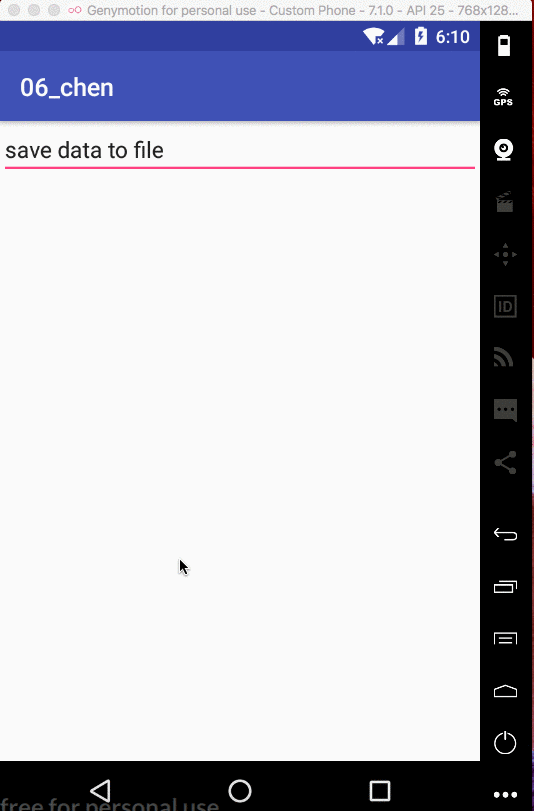
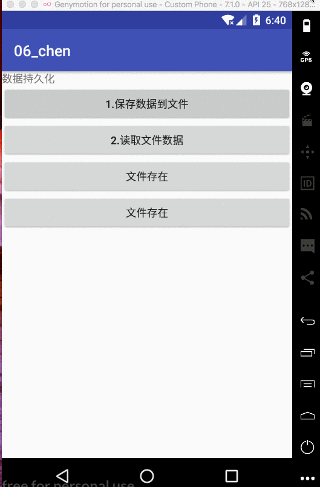
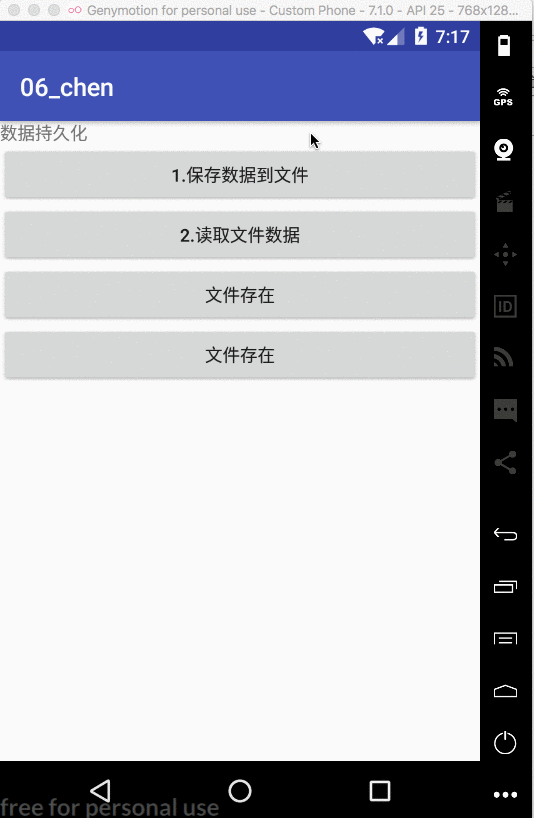
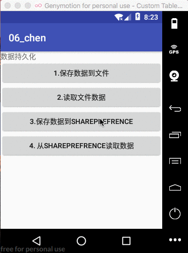

Android数据存储

[TOC]

---

> 简介：数据持久化就是将内存中的瞬时数据保存到存储设备中，保证及时在设备关机的情况下数据仍然不丢失。


## 1. 文件存储

> 是Android设备中最基本的存储方式，不对存储的内容进行任何格式化处理，所有数据原封不动的保存到文件中。

### 1.1 将数据保存到文件中

```java
     /**
     * 保存EditText的数据到文件
     */
    private void saveEditDateToFile() {

        String data = et_input_content.getText().toString();
        FileOutputStream out = null;
        BufferedWriter writer = null;

        //MODE_PRIVATE:同样文件名的时候，覆盖
        //MODE_APPEND:追加
        try {

            out = openFileOutput("data",MODE_PRIVATE);
            writer = new BufferedWriter(new OutputStreamWriter(out));
            writer.write(data);


            if(writer!=null) {
                writer.close();
            }

            Toast.makeText(this, "保存数据到'data'文件", Toast.LENGTH_SHORT).show();


        } catch (FileNotFoundException e) {
            e.printStackTrace();
        } catch (IOException e) {
            e.printStackTrace();
        }


    }
```
>效果：

 

### 1.2 从文件中读取数据

>从文件中读取数据: 将第一步保存的数据读取出来显示到textview中


>code

```java

    /**
     * 从包下的 data 文件中读取数据
     */
    private String readDataFromFile() {
        FileInputStream in = null;
        BufferedReader reader = null;

        StringBuilder content = new StringBuilder();

        try {
            in = openFileInput("data");
            reader = new BufferedReader(new InputStreamReader(in));
            String line = "";

            while ((line = reader.readLine()) != null) {
                content.append(line);
            }

            if(reader!=null) {
                reader.close();
            }
        } catch (FileNotFoundException e) {
            e.printStackTrace();
        } catch (IOException e) {
            e.printStackTrace();
        }

        if(content!=null&&!content.equals("")) {
            return content.toString();
        }else {
            return "no data";
        }

   
}

```


>效果

 


### 1.3 加载布局时初始化数据

> 加载布局时，从文件中加载数据

```java

    /**
     * 加载布局后从本地文件初始化数据
     */
    private void initData() {
        String content = readDataFromFile();
        if(!content.equals("")) {
            et_input_content.setText(content);
        }
    }
```


```java
    /**
     * 从本地文件读取数据
     * @return
     */
    private String readDataFromFile() {
        FileInputStream in = null;
        BufferedReader reader = null;
        StringBuilder content = new StringBuilder();

        try {
            in = openFileInput("data");
            reader = new BufferedReader(new InputStreamReader(in));
            String line = "";

            while ((line = reader.readLine())!=null){
                content.append(line);
            }

            if(reader!=null) {
                reader.close();
            }

        } catch (FileNotFoundException e) {
            e.printStackTrace();
        } catch (IOException e) {
            e.printStackTrace();
        }

        if(content.toString().equals("")) {
            return "no data ";
        }else {
            return content.toString();
        }
    }
```

>效果：

 


## 2. SharePrefrence

>简介：
sharepreferences 是采用键-值对的方式保存数据,保存数据时需要同时提供数据的值和其对应的键， 读取数据时同样根据数据的键读取数据的值。

### 1. 使用sp保存数据

> 步骤：
1. 获取sp.editor
2. 执行editor.putxxx操作
3. 执行editor.apply操作

```java
    private void saveDataToSP() {

        SharedPreferences.Editor editor = getSharedPreferences("data",MODE_PRIVATE).edit();
        String name= et_input_name.getText().toString();

        int age = 0;

        if(!et_input_age.getText().toString().equals("")) {
            age = Integer.parseInt( et_input_age.getText().toString());
        }
        boolean male = true;

        if(!et_input_bl.getText().toString().equals("")) {
                male = Boolean.parseBoolean(et_input_bl.getText().toString());
        }

        editor.putString("name",name);
        editor.putInt("age",age);
        editor.putBoolean("male",male);
        editor.apply();

        Toast.makeText(this, "savedata to sp", Toast.LENGTH_SHORT).show();
    }
```


### 2. 读取sp中的数据

>步骤：
1. 获取sp
2. 执行sp.getXXX方法


```java
    private void loadDataFromSP() {
        SharedPreferences sp = getSharedPreferences("data", MODE_PRIVATE);
        String name = sp.getString("name","null");
        int age = sp.getInt("age", 0);
        boolean male = sp.getBoolean("male", false);

        et_input_name.setText(name);
        et_input_age.setText(age+"");
        et_input_bl.setText(male+"");
    }
```


### 3. 清空sp文件中的数据

>步骤：
1. 获取sp
2. 执行clear操作
3. 执行apply操作

```java
    private void clearSP() {
        SharedPreferences.Editor editor = getSharedPreferences("data", MODE_PRIVATE).edit();
        editor.clear();//clear sp
        editor.apply();
    }
```


### 4. 效果

 


