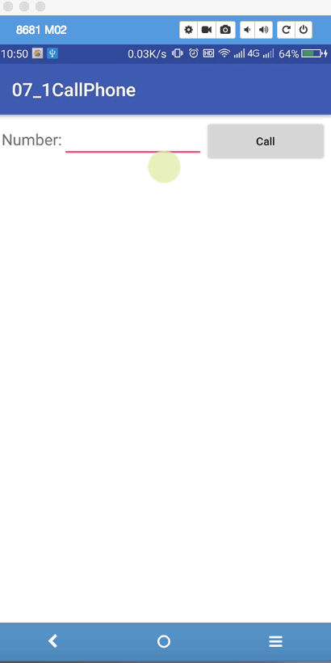
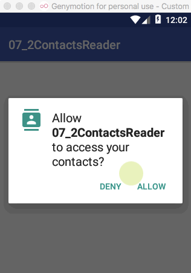

Android 跨程序共享数据

# 1. Android 运行时权限申请

>Android6.0 以后敏感的操作需要添加运行时权限，以打电话为例

## 1. 编写布局，文件，实现输入号码按call键直接拨打电话

```xml
<?xml version="1.0" encoding="utf-8"?>
<LinearLayout xmlns:android="http://schemas.android.com/apk/res/android"
    xmlns:app="http://schemas.android.com/apk/res-auto"
    xmlns:tools="http://schemas.android.com/tools"
    android:layout_width="match_parent"
    android:layout_height="match_parent"
    android:padding="5dp"
    tools:context="com.example.a07_1callphone.MainActivity">

    <TextView
        android:textSize="20sp"
        android:text="Number:"
        android:textAllCaps="false"
        android:layout_width="wrap_content"
        android:layout_height="wrap_content" />
    <EditText
        android:id="@+id/et_phone_number"
        android:layout_weight="3"
        android:layout_width="wrap_content"
        android:layout_height="wrap_content" />

    <Button
        android:id="@+id/bt_call_phone"


        android:textAllCaps="false"
        android:layout_weight="1"
        android:text="Call"
        android:layout_width="wrap_content"
        android:layout_height="wrap_content" />

</LinearLayout>
```


## 2. MainActivity中添加初始化对象，并添加点击事件响应

```java
public class MainActivity extends AppCompatActivity implements View.OnClickListener {

    private Button bt_call_phone;
    private EditText et_phone_number;

    @Override
    protected void onCreate(Bundle savedInstanceState) {
        super.onCreate(savedInstanceState);
        setContentView(R.layout.activity_main);

        bt_call_phone = (Button) findViewById(R.id.bt_call_phone);
        et_phone_number = (EditText) findViewById(R.id.et_phone_number);

        bt_call_phone.setOnClickListener(this);
    }

    @Override
    public void onClick(View view) {
        if (view.getId() == R.id.bt_call_phone) {
            callPhone();
            Toast.makeText(this, "call", Toast.LENGTH_SHORT).show();
        }
    }
}

```

## 3. 在点击事件响应函数中，添加运行时权限代码

```java

    /**
     * callphone function
     */
    private void callPhone() {

        /**
         * 运行时权限的检查与申请
         */
        if (ActivityCompat.checkSelfPermission(this, Manifest.permission.CALL_PHONE) != PackageManager.PERMISSION_GRANTED) {
            ActivityCompat.requestPermissions(MainActivity.this, new String[]{Manifest.permission.CALL_PHONE}, 1);

        } else {
            Intent inten = new Intent(Intent.ACTION_CALL);
            inten.setData(Uri.parse("tel:" + et_phone_number.getText().toString()));
            startActivity(inten);
        }
    }
```


>效果：

 

# 2. 访问其他程序中的数据

>内容提供器的⽤法⼀般有两种， ⼀种是使⽤现有的内容提供器来读取和操作相应程序中的数据， 另⼀种是创建⾃⼰的内容提供器给我们程序的数据提供外部访问接口。

> 案例：读取手机联系人显示在listview中
> 

## 1. 布局文件 listview

```xml
<ListView
    android:id="@+id/lv_contact_list"
    android:layout_width="match_parent"
    android:layout_height="wrap_content">

</ListView>
```


## 2. MainActivity 相关函数调用

```java
    private ListView lv_contact_list;
    private List<String> contactsList = new ArrayList<>();
    ArrayAdapter<String> adapter;

    @Override
    protected void onCreate(Bundle savedInstanceState) {
        super.onCreate(savedInstanceState);
        setContentView(R.layout.activity_main);
        lv_contact_list = (ListView) findViewById(R.id.lv_contact_list);

        setListViewAdapter();

        checkRuntimePermission();

        //readContacts();

    }
```


## 3. listview 设置adapter

```java
    /**
     * 设置listview 的adapter
     */
    private void setListViewAdapter() {
        adapter = new ArrayAdapter<String>(MainActivity.this, android.R.layout.simple_list_item_1, contactsList);
        lv_contact_list.setAdapter(adapter);
    }
```


## 4. 检查运行时权限 
```java
    /**
     * 检查运行时权限
     */
    private void checkRuntimePermission() {
        if(ContextCompat.checkSelfPermission(this, Manifest.permission.READ_CONTACTS)!= PackageManager.PERMISSION_GRANTED) {
            ActivityCompat.requestPermissions(MainActivity.this,new String[]{Manifest.permission.READ_CONTACTS},1);
        }else {
            readContacts();
        }
    }
```


## 5. 权限检查相应通过时读取联系人数据

```java
    @Override
    public void onRequestPermissionsResult(int requestCode, @NonNull String[] permissions, @NonNull int[] grantResults) {
        //super.onRequestPermissionsResult(requestCode, permissions, grantResults);
        
        switch (requestCode){
            case 1: 
                if(grantResults.length>0&&grantResults[0]==PackageManager.PERMISSION_GRANTED) {
                    readContacts();
                }else {
                    Toast.makeText(this, "Refused to read Contacts!!!", Toast.LENGTH_SHORT).show();
                }
                break;
            default:
        }
    }
```


## 6. 联系人数据读取函数

```java
    /**
     * 读取联系人数据
     */
    private void readContacts() {
        Cursor cussor = null;


        cussor  = getContentResolver().query(ContactsContract.CommonDataKinds.Phone.CONTENT_URI, null, null, null, null);

        if (cussor != null) {
            while (cussor.moveToNext()) {
                String name = cussor.getString(cussor.getColumnIndex(ContactsContract.CommonDataKinds.Phone.DISPLAY_NAME));
                String number = cussor.getString(cussor.getColumnIndex(ContactsContract.CommonDataKinds.Phone.NUMBER));
                contactsList.add(name + "\n" + number);
            }
            adapter.notifyDataSetChanged();
        }

    }

```


## 7. manifest 添加权限

```xml
    <uses-permission android:name="android.permission.READ_CONTACTS"/>
```


>效果：

 


# 3. 创建自己的内容提供器(ContentProvider)


