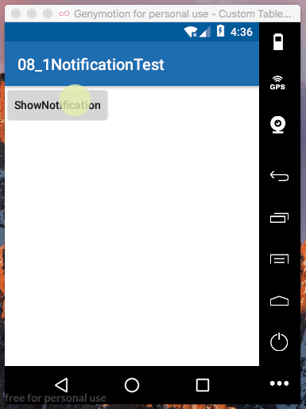

[TOC]

---


# 1. 通知的基本用法
>使用说明

## 1. 布局文件

```xml
    <Button
        android:id="@+id/bt_show_notification"
        android:text="ShowNotification"
        android:textAllCaps="false"
        android:layout_width="wrap_content"
        android:layout_height="wrap_content" />
```

## 2. MainActivity

```java
  @Override
    protected void onCreate(Bundle savedInstanceState) {
        super.onCreate(savedInstanceState);
        setContentView(R.layout.activity_main);
        bt_show_notification = (Button)findViewById(R.id.bt_show_notification);
        bt_show_notification.setOnClickListener(this);
    }

```


## 3. 点击事件响应函数
```java
    @Override
    public void onClick(View view) {
        Toast.makeText(this, "show", Toast.LENGTH_SHORT).show();
        sendNotification();

    }

```


## 4. 发送通知栏消息

> 1. 创建通知栏管理manager对象
> 2. 使用builder 构造器创建notification对象
> 3. 设置notification的相关参数
>    - 标题
>    - 内容
>    - 启动时间
>    - 小图标
>    - 大图标
>    - builder()
> 4. 执行manager.notify() 方法
> 

```java
  /**
     * 发送通知栏通知
     */
    private void sendNotification() {
        //1. 获取通知管理manager
        NotificationManager manager = (NotificationManager) getSystemService(Context.NOTIFICATION_SERVICE);

        //2. 使用builder构造器创建notification对象
        Notification notification = new NotificationCompat.Builder(context)
                .setContentTitle("title")
                .setContentText("this is  notification from test")
                .setWhen(System.currentTimeMillis())
                .setSmallIcon(R.mipmap.ic_launcher)
                .setLargeIcon(BitmapFactory.decodeResource(getResources(),R.mipmap.ic_launcher))
                .build();

        manager.notify(1,notification);

    }

```

>效果：（不能点击）

 

# 2. 使notification能点击


## 1. 创建intent 对应的布局文件（点击通知栏后进入）
```xml
    <TextView
        android:gravity="center"
        android:textSize="20sp"
        android:text="Notification Page"
        android:textAllCaps="false"
        android:layout_width="match_parent"
        android:layout_height="match_parent" />
```


## 2. 创建intent对应的Activity
```java
public class NotificationActivity extends AppCompatActivity {

    @Override
    protected void onCreate(Bundle savedInstanceState) {
        super.onCreate(savedInstanceState);
        setContentView(R.layout.activity_notification);
    }
}
```

## 3. 修改启动通知栏的响应函数，添加intent和setcontentInten()

> 

```java

    /**
     * 发送通知栏通知
     */
    private void sendNotification() {
        //1. 获取通知管理manager
        NotificationManager manager = (NotificationManager) getSystemService(Context.NOTIFICATION_SERVICE);

        Intent intent = new Intent(this,NotificationActivity.class); //创建intent 

        PendingIntent pi = PendingIntent.getActivity(this,0,intent,0); //制定跳转的intent
//        PendingIntent pi = PendingIntent.getActivities(this,0,new Intent[]{intent},0);
        //2. 使用builder构造器创建notification对象
        Notification notification = new NotificationCompat.Builder(context)
                .setContentTitle("title")
                .setContentText("this is  notification from test")
                .setWhen(System.currentTimeMillis())
                .setSmallIcon(R.mipmap.ic_launcher)
                .setLargeIcon(BitmapFactory.decodeResource(getResources(),R.mipmap.ic_launcher))
                .setContentIntent(pi) //为通知栏添加intent
                .build();

        manager.notify(1,notification);

    }

```


>效果：

 


# 3. 取消通知栏图标

>当点击通知栏后，取消通知栏图标

1. 方式一

> 创建notification的时候设置可以自动取消

```java
        Notification notification = new NotificationCompat.Builder(context)
    
                .setContentTitle("title")
                ....
                .setAutoCancel(true)// 点击后自动取消通知栏图标
                .build();
        manager.notify(1,notification);
```


2. 方式二

> 在启动跳转后的页面中取消：NotificationActivity

```java
public class NotificationActivity extends AppCompatActivity {

    @Override
    protected void onCreate(Bundle savedInstanceState) {
        super.onCreate(savedInstanceState);
        setContentView(R.layout.activity_notification);

        NotificationManager manager = (NotificationManager) getSystemService(NOTIFICATION_SERVICE);
        manager.cancel(1); //1--对应notification id
    }
}


```

# 4. 通知栏进阶

## 1. 通知设置声音

```java
     .setSound(Uri.fromFile(new File("/system/media/audio/ringtones/IceLead.ogg"))) //使用声音 
```

## 2. 通知设置震动

```java
  .setVibrate(new long[]{0,3000,1000,2000}) //使用震动
```
> 添加权限

```xml
    <!--使用震动权限-->
    <uses-permission android:name="android.permission.VIBRATE"/>
```


## 3. 通知设置LED灯显示

```java
.setLights(Color.GREEN,1000,2000)// 设置颜色， {颜色，亮的时长，暗的时长}
```


## 4. 通知栏设置默认提示效果
```java
.setDefaults(NotificationCompat.DEFAULT_ALL) //使用通知的默认效果
```

# 5. 通知栏高级

> setStyle() --构建富文本的通知内容

## 1. 通知栏设置样式(style)
### 1. 显示长文本
```java
        Notification notification = new NotificationCompat.Builder(context)
                .setContentTitle("通知")
                .setWhen(System.currentTimeMillis())
                .setAutoCancel(true)
                .setSmallIcon(R.mipmap.ic_launcher)
                .setLargeIcon(BitmapFactory.decodeResource(getResources(),R.mipmap.ic_launcher))
                .setStyle(new NotificationCompat.BigTextStyle().bigText("This is a notifiacatioin form notification test," +
                        " and you can see massage from the main context."))
                .build();
```


>效果：

 


### 2. 显示大图片

```java
        Notification notification = new NotificationCompat.Builder(context)
                .setContentTitle("通知")
                .setWhen(System.currentTimeMillis())
                .setAutoCancel(true)
                .setSmallIcon(R.mipmap.ic_launcher)
                .setStyle(new NotificationCompat.BigPictureStyle().bigPicture(BitmapFactory.decodeResource(getResources(),R.drawable.big_image)))
                .build();

```

> 效果：

 


## 2. 通知设置重要程度(Priority)

> 设置通知等级最高

```java
.setPriority(NotificationCompat.PRIORITY_MAX) //设置通知等级最高
```

> 效果：

 


