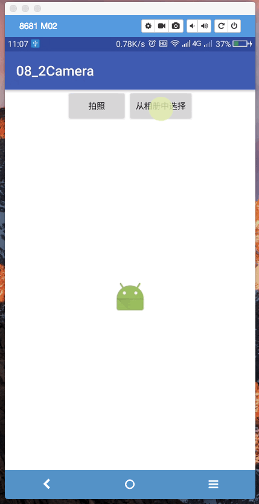
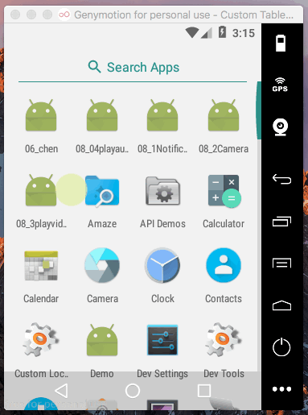
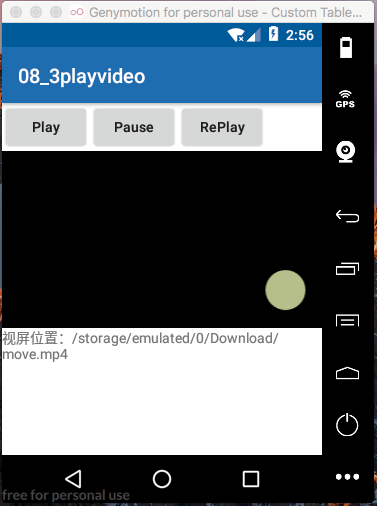

[TOC]

---


## 1. 调用摄像头添加图像
### 1. 布局文件

>布局文件：两个 button 分别为拍照和从相册中选择

```xml

    <LinearLayout
        android:gravity="center"
        android:orientation="horizontal"
        android:layout_width="match_parent"
        android:layout_height="wrap_content">

    <Button
        android:id="@+id/bt_get_camera"
        android:layout_width="wrap_content"
        android:layout_gravity="center"

        android:layout_height="wrap_content"
        android:text="拍照" />

    <Button
        android:text="从相册中选择"
        android:id="@+id/bt_chose_album"
        android:layout_width="wrap_content"
        android:layout_height="wrap_content" />

    </LinearLayout>


    <LinearLayout
        android:gravity="center"
        android:layout_width="match_parent"
        android:layout_height="match_parent">
        <ImageView
            android:id="@+id/iv_img"
            android:src="@mipmap/ic_launcher"
            android:layout_width="wrap_content"
            android:layout_height="wrap_content" />

    </LinearLayout>
```

### 2. 初始化视图对象并添加点击事件
```java
    /**
     * @param view
     */
    @Override
    public void onClick(View view) {
        switch (view.getId()) {
            case R.id.bt_get_camera:
                Toast.makeText(this, "camera", Toast.LENGTH_SHORT).show();
                takePhoto();//执行拍照方法
                break; 
        }

    }
```


### 3. 启动 intent 拍照实现逻辑

> 步骤：

1. 创建 outputImage对象，保存相机拍摄的照片
2. 根据不同版本，确定获取imageUri 的方法
3. 启动相机
    - 启动 intent  ：android.media.action.IMAGE_CAPTURE
    - 调用 putExtra() 传入要保存的图片uri
    - 使用带结果回调的方式，启动 intent：startActivityForResult(intent, TAKE_PHOTO);


```java
    /**
     * 调用摄像头拍照
     */
    private Uri imageUri;
    private void takePhoto() {
        ///storage/emulated/0/Android/data/com.example.a08_2camera/cache/output_image.jpg
        //1. 
        File outputImage = new File(getExternalCacheDir(), "output_image.jpg");

        if (outputImage.exists()) {
            outputImage.delete();
        }
        try {
            outputImage.createNewFile();

        } catch (IOException e) {
            e.printStackTrace();
        }

        //2. 根据不同版本，确定 uri
        if (Build.VERSION.SDK_INT >= 24) {//6.0及以上版本
            imageUri = FileProvider.getUriForFile(MainActivity.this, "com.example.cameraalbumtest.fileprovider", outputImage);
            Log.d("MainActivity", "Build.VERSION.SDK_INT:" + Build.VERSION.SDK_INT);
        } else {
            imageUri = Uri.fromFile(outputImage);
            Log.d("MainActivity", "Build.VERSION.SDK_INT:" + Build.VERSION.SDK_INT);
        }

        Log.d("MainActivity", "outputImage:" + outputImage.toString());

        //3. 启动相机
        Intent intent = new Intent("android.media.action.IMAGE_CAPTURE");
        intent.putExtra(MediaStore.EXTRA_OUTPUT, imageUri);
        startActivityForResult(intent, TAKE_PHOTO);
    }

```


### 4. 编写 Intent 调用响应函数
>拍照成功，将调用以下方法，将保存的照片读取出来，显示到 imageview 中

```java

    @Override
    protected void onActivityResult(int requestCode, int resultCode, Intent data) {
//        super.onActivityResult(requestCode, resultCode, data);
        switch (requestCode) {
            case TAKE_PHOTO: //请求码是TAKE_PHOTO
                if (resultCode == RESULT_OK) {
                    try {
                        Bitmap bitmap = BitmapFactory.decodeStream(getContentResolver().openInputStream(imageUri));

                        iv_img.setImageBitmap(bitmap);//设置显示图片

                    } catch (FileNotFoundException e) {
                        e.printStackTrace();
                    }
                }
                break;
    }
}
```

### 5. 编写 provider 相关代码
> 在第三步的获取图片 uri 时，若版本大于6.0 则使用 provider，因此需要在 manifest 中注册 provider 

#### 1. 注册 provider 
```xml
        <provider
            android:authorities="com.example.cameraalbumtest.fileprovider"
            android:name="android.support.v4.content.FileProvider"
            android:exported="false"
            android:grantUriPermissions="true">
            <meta-data android:name="android.support.FILE_PROVIDER_PATHS"
                android:resource="@xml/file_paths"/>
```


#### 2. 创建资源文件 xml
> 新建 res/file_paths.xml

```xml
<?xml version="1.0" encoding="utf-8"?>
<paths xmlns:android="http://schemas.android.com/apk/res/android">
    <external-path name="my_images" path = ""/>
</paths>
```


### 6. manifest添加读写sd卡权限
```xml
    <uses-permission android:name="android.permission.WRITE_EXTERNAL_STORAGE"/>
```

### 7. 效果
 


## 2. 调用相册添加头像
> 简介：点击按钮，调用相册，选择图片后设置到imageview中

### 1. 布局文件，同上

### 2. 添加相应事件
```java
    public void onClick(View view) {
        switch (view.getId()) {//1. 调用相机拍照
            case R.id.bt_get_camera:
                Toast.makeText(this, "camera", Toast.LENGTH_SHORT).show();
                takePhoto();
                break;

            //2. 打开相册
            case R.id.bt_chose_album:
                Toast.makeText(this, "chose ", Toast.LENGTH_SHORT).show();
                chosePhoto();

                break;
        }

    }
```


### 3. chosePhoto实现函数
1. 授予运行时权限
2. 执行打开相册功能函数 


```java
    private void chosePhoto() {
        if (ContextCompat.checkSelfPermission(this, Manifest.permission.WRITE_EXTERNAL_STORAGE) != PackageManager.PERMISSION_GRANTED) {
            ActivityCompat.requestPermissions(MainActivity.this, new String[]{Manifest.permission.WRITE_EXTERNAL_STORAGE},1);
        } else {

            openAlbum();
        }
    }
```


### 4. 打开相册功能函数代码
> 使用带回调方式启动intent

```java
    private void openAlbum() {
        Intent intent = new Intent("android.intent.action.GET_CONTENT");
        intent.setType("image/*");
        startActivityForResult(intent, CHOSE_PHOTE);
    }
```


### 5. Intent响应完成的回调函数
> 根据不同版本，确定不同方式获取intent返回的图片

- 当系统版本>=4.4 调用handleImageOnKitKat(data);
- 当系统版本<4.4 handleImageBeforeKitKat(data);


```java


    @Override
    protected void onActivityResult(int requestCode, int resultCode, Intent data) {
//        super.onActivityResult(requestCode, resultCode, data);
        switch (requestCode) {
            ......
            case CHOSE_PHOTE:
                if (resultCode == RESULT_OK) {
                    if (Build.VERSION.SDK_INT >= 19) {//4.4及以上系统
                        handleImageOnKitKat(data);
                    } else {//4.4  及以下系统
                        handleImageBeforeKitKat(data);
                    }
                }
                break;
        }
    }
```

### 6. 获取intent返回的图片
>根据不同版本，确定不同方式获取intent返回的图片

#### 1. Android4.4及以上系统 

1. 判断intent返回的data类型，并根据不同类型获取相应的uri
    + doc型uri
        * com.android.providers.media.documents
        * com.android.providers.downloads.documents
    + content型uri
    + file类型uri
2. 显示图片到imageview


```java
    private void handleImageOnKitKat(Intent data) {

        String imagePath = null;
        Uri uri = data.getData();
        if (DocumentsContract.isDocumentUri(MainActivity.this, uri)) {//如果是doc类型的uri
            String docId = DocumentsContract.getDocumentId(uri);
            if ("com.android.providers.media.documents".equalsIgnoreCase(uri.getAuthority())) {
                String id = docId.split(":")[1];//解析出数字格式的id
                String selection = MediaStore.Images.Media._ID + "=" + id;
                imagePath = getImagePath(MediaStore.Images.Media.EXTERNAL_CONTENT_URI, selection);

            } else if ("com.android.providers.downloads.documents".equals(uri.getAuthority())) {
                Uri contentUri = ContentUris.withAppendedId(Uri.parse("content://downloads/public_downloads"), Long.valueOf(docId));
                imagePath = getImagePath(contentUri, null);
            }

        } else if ("content".equalsIgnoreCase(uri.getScheme())) {//如果是content类型的uri
            imagePath = getImagePath(uri, null);

        } else if ("file".equalsIgnoreCase(uri.getScheme())) {  //如果是file 类型的uri
            imagePath = uri.getPath();

        }

        displayImage(imagePath);
    }
```


#### 2. Android4.4以前系统

```java
    private void handleImageBeforeKitKat(Intent data) {
        Uri uri = data.getData();
        String imagePath = getImagePath(uri, null);

        displayImage(imagePath);
    }
```


#### 3. 获取图片地址
```java
    private String getImagePath(Uri uri, String selection) {
        String path = null;
        //通过uri和selection 获取真实图片路径
        Cursor cursor = getContentResolver().query(uri, null, selection, null, null);
        if (cursor != null && cursor.moveToFirst()) {
            path = cursor.getString(cursor.getColumnIndex(MediaStore.Images.Media.DATA));

            cursor.close();
        }
        return path;
    }
```

#### 4. 显示图片
```java
    private void displayImage(String imagePath) {

        if (imagePath != null) {
            Bitmap bitmap = BitmapFactory.decodeFile(imagePath);
            iv_img.setImageBitmap(bitmap);
        } else {
            Toast.makeText(this, "fail to get image", Toast.LENGTH_SHORT).show();
        }
    }
```


### 7. 效果：
 


## 3. 播放音频
>mediaPlayer API说明

| 方法| 功能描述 |
| ------------- | ------------- |
| setDataSource(）| 设置播放音频的文件位置 |
|prepare()|开始播放前调用该方法完成准备工作|
|start()|开始或者继续播放|
|pause()| 暂停播放|
|reset()| 对mediaplayer对象重置到刚刚创建时的状态|
|seekTo()| 跳转到指定位置播放|
|stop()|停止播放音频|
|release()|释放mediaplayer相关的资源|
|isPlaying()|判断mediaplayer是否正在播放视频|
|getDuration()|获取载入的视频的长度|


>功能：播放，暂停，重新播放，显示播放进度

### 1. 布局文件

```xml
    <LinearLayout
        android:layout_width="match_parent"
        android:layout_height="wrap_content">
        <Button
            android:id="@+id/bt_play"

            android:textAllCaps="false"
            android:text="Play"
            android:layout_width="wrap_content"
            android:layout_height="wrap_content" />
        <Button
            android:id="@+id/bt_replay"

            android:textAllCaps="false"
            android:text="RePlay"
            android:layout_width="wrap_content"
            android:layout_height="wrap_content" />
        <Button
            android:id="@+id/bt_pause"

            android:textAllCaps="false"
            android:text="Pause"
            android:layout_width="wrap_content"
            android:layout_height="wrap_content" />
    </LinearLayout>

    <SeekBar
        android:id="@+id/sb_audio_progress"
        android:layout_width="match_parent"
        android:layout_height="wrap_content" />
    <TextView
        android:id="@+id/tv_audio_info"
        android:hint="info"
        android:padding="10dp"
        android:layout_width="wrap_content"
        android:layout_height="wrap_content" />


```


### 2. onCreate()
1. 初始化视图对象
2. 添加点击事件
3. 运行时权限检查

```java
    @Override
    protected void onCreate(Bundle savedInstanceState) {
        super.onCreate(savedInstanceState);
        setContentView(R.layout.activity_main);

        bt_play = (Button) findViewById(R.id.bt_play);
        bt_replay = (Button) findViewById(R.id.bt_replay);
        bt_pause = (Button) findViewById(R.id.bt_pause);

        sb_audio_progress = (SeekBar)findViewById(R.id.sb_audio_progress);
        tv_audio_info = (TextView) findViewById(R.id.tv_audio_info);


        bt_replay.setOnClickListener(this);
        bt_pause.setOnClickListener(this);
        bt_play.setOnClickListener(this);

        checkRunTimePermission();
    }

```

### 3. 检查并申请运行时权限
- 若没有授予权限，申请权限
- 若已经授予过权限，执行数据初始化


```java
       private void checkRunTimePermission() {
        if (ContextCompat.checkSelfPermission(MainActivity.this, Manifest.permission.WRITE_EXTERNAL_STORAGE) != PackageManager.PERMISSION_GRANTED) {
            ActivityCompat.requestPermissions(MainActivity.this, new String[]{Manifest.permission.WRITE_EXTERNAL_STORAGE}, 1);
        } else {
            initAudioData();
        }

    }

```

> 判断权限授予情况

```java
    @Override
    public void onRequestPermissionsResult(int requestCode, @NonNull String[] permissions, @NonNull int[] grantResults) {
        super.onRequestPermissionsResult(requestCode, permissions, grantResults);
        switch (requestCode) {
            case REQUEST_WRITE_SD:
                if (grantResults.length > 0 && grantResults[0] == PackageManager.PERMISSION_GRANTED) {
                    initVideoData();

                } else {
                    Toast.makeText(this, "申请权限被拒绝，关闭程序", Toast.LENGTH_SHORT).show();
                    finish();//关闭
                }
                break;

        }
    }

```


### 4. 初始化音频数据
- 1. 设置视频路径
- 2. textview显示音频信息

```java
      private void initAudioData() {
        File file = new File(Environment.getExternalStorageDirectory() + "/Download/", "live.mp3");
      //  File file = new File(Environment.getExternalStorageDirectory() , "zj.mp3");
        try {
            mediaPlayer = new MediaPlayer();
            mediaPlayer.setDataSource(file.getPath());
            tv_audio_info.setText(file.getPath());
            mediaPlayer.prepare();

            int duration = mediaPlayer.getDuration();
            sb_audio_progress.setMax(duration);


            //handler.sendEmptyMessageDelayed(UPDATE_PROGRESS,500);
        } catch (IOException e) {
            e.printStackTrace();
        }
    }
```


### 5. onClick 响应播放动作
```java

    @Override
    public void onClick(View view) {
        switch (view.getId()){
            case R.id.bt_play:
                if(!mediaPlayer.isPlaying()) {
                    mediaPlayer.start();
                    handler.removeMessages(UPDATE_PROGRESS);
                    handler.sendEmptyMessageDelayed(UPDATE_PROGRESS,100);
                }

                break;
            case R.id.bt_pause:
                if(mediaPlayer.isPlaying()) {
                    mediaPlayer.pause();
                    handler.removeMessages(UPDATE_PROGRESS);
                }else {
                    mediaPlayer.start();
                    handler.removeMessages(UPDATE_PROGRESS);
                    handler.sendEmptyMessageDelayed(UPDATE_PROGRESS,100);
                }
                break;
            case R.id.bt_replay:
//                if(mediaPlayer.isPlaying()) {
//                }
                    mediaPlayer.reset();
                    initAudioData();
                    mediaPlayer.start();
                    handler.removeMessages(UPDATE_PROGRESS);
                    handler.sendEmptyMessageDelayed(UPDATE_PROGRESS,100);
                break;
        }

    }
```


### 6. onDestroy中释放资源回收handler
```java
    @Override
    protected void onDestroy() {

        //1. 释放资源
        if(mediaPlayer!=null) {
            mediaPlayer.stop();
            mediaPlayer.release();
        }
        //2. 回收消息
        handler.removeCallbacksAndMessages(UPDATE_PROGRESS);
    }
```


### 7. 使用handler同步显示信息更新seekbar
```java

    private Handler handler = new Handler(){

        @Override
        public void handleMessage(Message msg) {
            super.handleMessage(msg);
            switch (msg.what){
                case 1:
                    int currentPosition = mediaPlayer.getCurrentPosition();
                    sb_audio_progress.setProgress(currentPosition);
                    Log.d("MainActivity", "handler update ");
                    handler.removeMessages(UPDATE_PROGRESS);
                    handler.sendEmptyMessageDelayed(UPDATE_PROGRESS,100);
                    tv_audio_info.setText("进度："+currentPosition+"/"+mediaPlayer.getDuration());
                    break;
            }
        }
    };
```

### 8. 添加权限
```xml
    <uses-permission android:name="android.permission.WRITE_EXTERNAL_STORAGE"/>
```

### 9. 效果
 


## 4. 播放视频
> 视频播放的常用函数（VideoView）

| 方法 | 功能|
| ------------- | ------------- |
| setVideoPath()| 设置要播放的视频的文件位置|
| start() |开始或者继续播放视频 |
|pause()| 暂停播放视频|
| seekTo()| 从指定位置播放视频|
|resume()| 将视频从头开始播放|
|isplaying（）| 判断当前视频是否正在播放|
|getDuration()| 获取视频时长|


> 点击不同按钮，分别实现本地视频，播放，暂停，重新播放
### 1. 布局文件

```xml 
    <LinearLayout

        android:layout_width="match_parent"
        android:layout_height="wrap_content">
        <Button
            android:text="Play"
            android:id="@+id/bt_play"
            android:textAllCaps="false"
            android:layout_width="wrap_content"
            android:layout_height="wrap_content" />

        <Button
            android:text="Pause"
            android:id="@+id/bt_pause"
            android:textAllCaps="false"
            android:layout_width="wrap_content"
            android:layout_height="wrap_content" />
        <Button
            android:text="RePlay"
            android:id="@+id/bt_replay"
            android:textAllCaps="false"
            android:layout_width="wrap_content"
            android:layout_height="wrap_content" />


    </LinearLayout>

    <VideoView
        android:id="@+id/vv_video_view"
        android:layout_width="match_parent"
        android:layout_height="wrap_content" />

```


### 2. onCreate中
1. 初始化视图对象
2. 添加点击事件
3. 运行时权限检查

```java
    @Override
    protected void onCreate(Bundle savedInstanceState) {
        super.onCreate(savedInstanceState);
        setContentView(R.layout.activity_main);

         vv_video_view= (VideoView) findViewById(R.id.vv_video_view);

        bt_play = (Button)findViewById(R.id.bt_play);
        bt_replay = (Button)findViewById(R.id.bt_replay);
        bt_pause = (Button)findViewById(R.id.bt_pause);

        bt_pause.setOnClickListener(this);
        bt_replay.setOnClickListener(this);
        bt_play.setOnClickListener(this);


        checkRunTimePermission();//运行时权限

    }

```

### 3. 运行时权限检查
- 没有权限，申请
- 有权限，执行初始化视频数据
 

```java
    private void checkRunTimePermission() {
        if(ContextCompat.checkSelfPermission(MainActivity.this, Manifest.permission.WRITE_EXTERNAL_STORAGE)!= PackageManager.PERMISSION_GRANTED) {
            ActivityCompat.requestPermissions(MainActivity.this,new String[]{Manifest.permission.WRITE_EXTERNAL_STORAGE},1);
        }else {
            initVideoData();//
        }
    }

```

> 权限申请响应 

```java

    @Override
    public void onRequestPermissionsResult(int requestCode, @NonNull String[] permissions, @NonNull int[] grantResults) {
        super.onRequestPermissionsResult(requestCode, permissions, grantResults);
        switch (requestCode){
            case REQUEST_WRITE_SD:
                if(grantResults.length>0&&grantResults[0]==PackageManager.PERMISSION_GRANTED) {
                    initVideoData();
                    
                }else {
                    Toast.makeText(this, "申请权限被拒绝，关闭程序", Toast.LENGTH_SHORT).show();
                    finish();//关闭
                }
                break;
            
        }
    }
```


### 4. 初始化视频数据
```java
    private void initVideoData() {
        //File move = new File(Environment.getExternalStorageDirectory()+"/Download/","move.mp4");
        File move = new File(Environment.getExternalStorageDirectory(),"historymap.mp4");
        String path = move.getPath();
        vv_video_view.setVideoPath(move.getPath());
    }

```


### 5. button点击事件
> 根据需求实现播放，暂停，重新播放功能
> 并发送handler实时同步视频播放状态

```java
 
    @Override
    public void onClick(View view) {
        switch (view.getId()) {

            case R.id.bt_play:
                Toast.makeText(this, "play", Toast.LENGTH_SHORT).show();
                if (!vv_video_view.isPlaying()) {
                    vv_video_view.start();
                    handler.removeMessages(UPDATE_INFO);
                    handler.sendEmptyMessageDelayed(UPDATE_INFO, 100);

                }

                break;
            case R.id.bt_pause:
                if (vv_video_view.isPlaying()) {
                    vv_video_view.pause();
                    handler.removeMessages(UPDATE_INFO);
                } else {
                    vv_video_view.start();
                    handler.removeMessages(UPDATE_INFO);
                    handler.sendEmptyMessageDelayed(UPDATE_INFO, 100);
                }


                break;
            case R.id.bt_replay:
                if (vv_video_view.isPlaying()) {
                    vv_video_view.resume();
                } else {
                    vv_video_view.resume();
                    vv_video_view.start();
                }
                handler.removeMessages(UPDATE_INFO);
                handler.sendEmptyMessageDelayed(UPDATE_INFO, 100);
                break;

        }

    }
```

### 6. 使用handler显示视屏播放进度

```java

    private Handler handler = new Handler() {
        @Override
        public void handleMessage(Message msg) {
            super.handleMessage(msg);
            switch (msg.what) {
                case UPDATE_INFO:
                    int duration = vv_video_view.getDuration();
                    int currentPosition = vv_video_view.getCurrentPosition();
                    tv_video_info.setText("进度：" + currentPosition + "/" + duration);

                    handler.removeMessages(UPDATE_INFO);
                    handler.sendEmptyMessageDelayed(UPDATE_INFO, 100);
                    break;
            }
        }
    };
```


### 7. onDestroy中释放资源回收handler
```java

    @Override
    protected void onDestroy() {
        super.onDestroy();
        //1. 释放视屏资源

        if (vv_video_view != null) {
            vv_video_view.suspend();
        }

        //2. 移除handler消息
        handler.removeCallbacksAndMessages(UPDATE_INFO);


    }
```

### 8. 读写sd权限

```xml
    <uses-permission android:name="android.permission.WRITE_EXTERNAL_STORAGE"/>
```


### 9.效果

 


