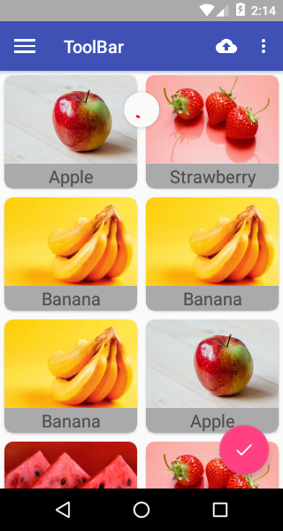

<!-- MarkdownTOC -->

- [1. 使用Toolbar](#1-%E4%BD%BF%E7%94%A8toolbar)
    - [1. 布局文件](#1-%E5%B8%83%E5%B1%80%E6%96%87%E4%BB%B6)
    - [2. Manifes文件](#2-manifes%E6%96%87%E4%BB%B6)
    - [3. 样式文件设置toolbar样式](#3-%E6%A0%B7%E5%BC%8F%E6%96%87%E4%BB%B6%E8%AE%BE%E7%BD%AEtoolbar%E6%A0%B7%E5%BC%8F)
    - [4. MainActivity 中添加支持](#4-mainactivity-%E4%B8%AD%E6%B7%BB%E5%8A%A0%E6%94%AF%E6%8C%81)
- [2. Toolbar 添加按钮和图片](#2-toolbar-%E6%B7%BB%E5%8A%A0%E6%8C%89%E9%92%AE%E5%92%8C%E5%9B%BE%E7%89%87)
    - [1. 创建按钮布局文件](#1-%E5%88%9B%E5%BB%BA%E6%8C%89%E9%92%AE%E5%B8%83%E5%B1%80%E6%96%87%E4%BB%B6)
    - [2. Activity 中加载menu布局,并设置监听](#2-activity-%E4%B8%AD%E5%8A%A0%E8%BD%BDmenu%E5%B8%83%E5%B1%80%E5%B9%B6%E8%AE%BE%E7%BD%AE%E7%9B%91%E5%90%AC)
    - [3. 显示效果](#3-%E6%98%BE%E7%A4%BA%E6%95%88%E6%9E%9C)
- [3. 滑动效果](#3-%E6%BB%91%E5%8A%A8%E6%95%88%E6%9E%9C)
    - [1. 使用DrawerLayout](#1-%E4%BD%BF%E7%94%A8drawerlayout)
    - [2.效果](#2%E6%95%88%E6%9E%9C)
- [3. Toolbar添加侧滑按钮](#3-toolbar%E6%B7%BB%E5%8A%A0%E4%BE%A7%E6%BB%91%E6%8C%89%E9%92%AE)
    - [1. 为Toolbar添加HomeAsUp 按钮](#1-%E4%B8%BAtoolbar%E6%B7%BB%E5%8A%A0homeasup-%E6%8C%89%E9%92%AE)
    - [2. 设置侧滑按钮的点击事件](#2-%E8%AE%BE%E7%BD%AE%E4%BE%A7%E6%BB%91%E6%8C%89%E9%92%AE%E7%9A%84%E7%82%B9%E5%87%BB%E4%BA%8B%E4%BB%B6)
    - [3. 效果](#3-%E6%95%88%E6%9E%9C)
- [4. 使用NavigationView](#4-%E4%BD%BF%E7%94%A8navigationview)
    - [1. 侧滑栏menu布局](#1-%E4%BE%A7%E6%BB%91%E6%A0%8Fmenu%E5%B8%83%E5%B1%80)
    - [2. 侧滑的头布局](#2-%E4%BE%A7%E6%BB%91%E7%9A%84%E5%A4%B4%E5%B8%83%E5%B1%80)
    - [3. mainactivity 布局中引用nav_view](#3-mainactivity-%E5%B8%83%E5%B1%80%E4%B8%AD%E5%BC%95%E7%94%A8navview)
    - [4. MainActivity 代码中使用](#4-mainactivity-%E4%BB%A3%E7%A0%81%E4%B8%AD%E4%BD%BF%E7%94%A8)
    - [5. 效果](#5-%E6%95%88%E6%9E%9C)
- [5. 使用旋风按钮 FloatingActionBar](#5-%E4%BD%BF%E7%94%A8%E6%97%8B%E9%A3%8E%E6%8C%89%E9%92%AE-floatingactionbar)
    - [1. activity_main.xml 中添加flaotingActionBar控件](#1-activitymainxml-%E4%B8%AD%E6%B7%BB%E5%8A%A0flaotingactionbar%E6%8E%A7%E4%BB%B6)
    - [2. 设置点击事件](#2-%E8%AE%BE%E7%BD%AE%E7%82%B9%E5%87%BB%E4%BA%8B%E4%BB%B6)
    - [3. 效果](#3-%E6%95%88%E6%9E%9C-1)
- [6. 使用SnackBar](#6-%E4%BD%BF%E7%94%A8snackbar)
    - [1. 使用](#1-%E4%BD%BF%E7%94%A8)
    - [2. 效果](#2-%E6%95%88%E6%9E%9C)
- [7. 使用CoodinatorLayout](#7-%E4%BD%BF%E7%94%A8coodinatorlayout)
    - [1. 使用](#1-%E4%BD%BF%E7%94%A8-1)
    - [2.效果](#2%E6%95%88%E6%9E%9C-1)
- [8. 卡片式布局Cardview](#8-%E5%8D%A1%E7%89%87%E5%BC%8F%E5%B8%83%E5%B1%80cardview)
    - [1. 基本用法](#1-%E5%9F%BA%E6%9C%AC%E7%94%A8%E6%B3%95)
    - [2. activity_main.xml中添加recycleview](#2-activitymainxml%E4%B8%AD%E6%B7%BB%E5%8A%A0recycleview)
    - [3. 设置recycleview 的adapter](#3-%E8%AE%BE%E7%BD%AErecycleview-%E7%9A%84adapter)
    - [4. MainActivity](#4-mainactivity)
    - [5. 效果](#5-%E6%95%88%E6%9E%9C-1)
- [9. 自动隐藏/显示toolbar: AppBarLayout](#9-%E8%87%AA%E5%8A%A8%E9%9A%90%E8%97%8F%E6%98%BE%E7%A4%BAtoolbar-appbarlayout)
    - [1. 消除recycleview遮挡toolbar](#1-%E6%B6%88%E9%99%A4recycleview%E9%81%AE%E6%8C%A1toolbar)
    - [2. 使用AppBarLayout 新特性](#2-%E4%BD%BF%E7%94%A8appbarlayout-%E6%96%B0%E7%89%B9%E6%80%A7)
    - [3. 效果](#3-%E6%95%88%E6%9E%9C-2)
- [10. 下拉刷新](#10-%E4%B8%8B%E6%8B%89%E5%88%B7%E6%96%B0)
    - [1. 修改布局](#1-%E4%BF%AE%E6%94%B9%E5%B8%83%E5%B1%80)
    - [2. 添加刷新逻辑](#2-%E6%B7%BB%E5%8A%A0%E5%88%B7%E6%96%B0%E9%80%BB%E8%BE%91)
    - [3. 效果](#3-%E6%95%88%E6%9E%9C-3)
- [11. 可折叠式标题栏](#11-%E5%8F%AF%E6%8A%98%E5%8F%A0%E5%BC%8F%E6%A0%87%E9%A2%98%E6%A0%8F)
    - [1. FruitActivity布局](#1-fruitactivity%E5%B8%83%E5%B1%80)
    - [2. FruitActivity代码](#2-fruitactivity%E4%BB%A3%E7%A0%81)
        - [1. initData :从inent中获取fruit数据](#1-initdata-%E4%BB%8Einent%E4%B8%AD%E8%8E%B7%E5%8F%96fruit%E6%95%B0%E6%8D%AE)
        - [2. 初始化控件](#2-%E5%88%9D%E5%A7%8B%E5%8C%96%E6%8E%A7%E4%BB%B6)
    - [3. RecyclerView设置监听,跳转到FruitActivity](#3-recyclerview%E8%AE%BE%E7%BD%AE%E7%9B%91%E5%90%AC%E8%B7%B3%E8%BD%AC%E5%88%B0fruitactivity)
    - [4. 效果](#4-%E6%95%88%E6%9E%9C)
- [12. 修改系统状态栏](#12-%E4%BF%AE%E6%94%B9%E7%B3%BB%E7%BB%9F%E7%8A%B6%E6%80%81%E6%A0%8F)
    - [1. 修改布局文件](#1-%E4%BF%AE%E6%94%B9%E5%B8%83%E5%B1%80%E6%96%87%E4%BB%B6)
    - [2. 定义一个FruitActivity主题](#2-%E5%AE%9A%E4%B9%89%E4%B8%80%E4%B8%AAfruitactivity%E4%B8%BB%E9%A2%98)
    - [3. style文件中添加新建的主题](#3-style%E6%96%87%E4%BB%B6%E4%B8%AD%E6%B7%BB%E5%8A%A0%E6%96%B0%E5%BB%BA%E7%9A%84%E4%B8%BB%E9%A2%98)
    - [4. Manifes文件修改FruitActivity 的主题](#4-manifes%E6%96%87%E4%BB%B6%E4%BF%AE%E6%94%B9fruitactivity-%E7%9A%84%E4%B8%BB%E9%A2%98)
    - [5. 效果](#5-%E6%95%88%E6%9E%9C-2)

<!-- /MarkdownTOC -->


## 1. 使用Toolbar
### 1. 布局文件

```xml
    <android.support.v7.widget.Toolbar
        android:id="@+id/tool_bar"
        android:layout_width="match_parent"

        android:layout_height="?attr/actionBarSize"
        android:background="?attr/colorPrimary"
        android:theme="@style/ThemeOverlay.AppCompat.Dark.ActionBar"
        app:popupTheme="@style/ThemeOverlay.AppCompat.Light">


    </android.support.v7.widget.Toolbar>

```

### 2. Manifes文件 
> 设置Toolbar字体 在activity标签中使用label 若不设置,默认使用 application 中的label


```

    <application
        android:allowBackup="true"
        android:icon="@mipmap/ic_launcher"
        android:label="@string/app_name"
        android:roundIcon="@mipmap/ic_launcher_round"
        android:supportsRtl="true"
        android:theme="@style/AppTheme">
        <activity
            android:name=".MainActivity"
            android:label="ToolBar">  //设置toolbar 文本

```

### 3. 样式文件设置toolbar样式
1. 通知栏颜色 primary 
2. 标题栏颜色 primaryDarky
3. 强调颜色 accent

```xml
    <!-- Base application theme. -->
    <style name="AppTheme" parent="Theme.AppCompat.Light.NoActionBar">
        <!-- Customize your theme here. -->
        <item name="colorPrimary">@color/colorPrimary</item>
        <item name="colorPrimaryDark">@android:color/darker_gray</item>
        <item name="colorAccent">@color/colorAccent</item>
    </style>
```


### 4. MainActivity 中添加支持

```java

public class MainActivity extends AppCompatActivity {

    @Override
    protected void onCreate(Bundle savedInstanceState) {
        super.onCreate(savedInstanceState);
        setContentView(R.layout.activity_main);

        Toolbar tool_bar = (Toolbar) findViewById(R.id.tool_bar);

        setSupportActionBar(tool_bar);       
        
        
    }
}
```

> 效果: 

 


## 2. Toolbar 添加按钮和图片

### 1. 创建按钮布局文件
> 参数

| 参数名 | 参数值 | 作用 |
| ------------- | ------------- |---|
| showAsAction | always | 永远显示在toolbar中,如果空间不够则不显示 |
| showAsAction | never | 永远显示在菜单中|
| showAsAction | ifRoom | 如果空间足够,显示在toolbar 中,否则显示在菜单中 |

>注意: toolbar 中的actioin按钮只会显示图标,菜单中的action按钮只会显示文字


```xml
<?xml version="1.0" encoding="utf-8"?>
<menu xmlns:android="http://schemas.android.com/apk/res/android"
    xmlns:app="http://schemas.android.com/apk/res-auto">
    <item
        android:id="@+id/back"
        android:icon="@drawable/ic_backup"
        android:title="Back"
        app:showAsAction="always" />
    <item
        android:id="@+id/delete"
        android:icon="@drawable/ic_delete"
        android:title="Delete"
        app:showAsAction="ifRoom" />
    <item
        android:id="@+id/setting"
        android:icon="@drawable/ic_settings"
        android:title="Setting"
        app:showAsAction="never" />


</menu>
```

### 2. Activity 中加载menu布局,并设置监听

> 加载布局

```java
    /**
     * 加载menu布局
     * @param menu
     * @return
     */
    @Override
    public boolean onCreateOptionsMenu(Menu menu) {
        getMenuInflater().inflate(R.menu.toolbar,menu);
        return true;
    }
Multi-line Code
```

> 点击监听

```java

    @Override
    public boolean onOptionsItemSelected(MenuItem item) {
        switch (item.getItemId()) {
            case R.id.back :
                Toast.makeText(this, "back", Toast.LENGTH_SHORT).show();
                break;
            case R.id.setting:
                Toast.makeText(this, "setting", Toast.LENGTH_SHORT).show();
                break;
            case R.id.delete:
                Toast.makeText(this, "delete", Toast.LENGTH_SHORT).show();
                break;

        }
        return true;
    }
```


### 3. 显示效果
 


## 3. 滑动效果

> 将一些菜单的效果隐藏起来,而不是显示在屏幕上

### 1. 使用DrawerLayout

> DrawerLayout 是一个布局,在其中允许放两个直接子控件

- 主屏幕显示的内容
- 滑动菜单显示的内容 


>注意

- DrawerLayout 包含两个子控件: FrameLayout 和 Textview 
- Textview 需要设置一个属性layout_gravity
    + left :从左侧滑入
    + right:从右侧滑入
    + start:安文字显示方向,开始位置


```xml

<?xml version="1.0" encoding="utf-8"?>


<android.support.v4.widget.DrawerLayout
    xmlns:android="http://schemas.android.com/apk/res/android"
    xmlns:app="http://schemas.android.com/apk/res-auto"
    android:layout_height="match_parent"
    android:layout_width="match_parent">


<FrameLayout
    android:layout_width="match_parent"
    android:layout_height="match_parent">

    <android.support.v7.widget.Toolbar
        android:id="@+id/tool_bar"
        android:layout_width="match_parent"

        android:layout_height="?attr/actionBarSize"
        android:background="?attr/colorPrimary"
        android:theme="@style/ThemeOverlay.AppCompat.Dark.ActionBar"
        app:popupTheme="@style/ThemeOverlay.AppCompat.Light">


    </android.support.v7.widget.Toolbar>

</FrameLayout>


    <!--侧滑的menu菜单-->


    <TextView
        android:text="this is  a menu"
        android:textSize="30sp"
        android:layout_gravity="start"


        android:background="#fff"
        android:layout_width="match_parent"
        android:layout_height="match_parent" />

</android.support.v4.widget.DrawerLayout>


```


### 2.效果

 


## 3. Toolbar添加侧滑按钮

> 在标题栏(toolbar)添加侧滑按钮,当点击按钮时,显示侧滑菜单

### 1. 为Toolbar添加HomeAsUp 按钮

> Oncrete 

```java
        //侧滑按钮
        drawerLayout = (DrawerLayout) findViewById(R.id.dl_draylayout);
        ActionBar actionBar = getSupportActionBar();
        if(actionBar!=null) {
            actionBar.setDisplayHomeAsUpEnabled(true);//HomeAsUp 按钮,默认图标是返回的箭头

            actionBar.setHomeAsUpIndicator(R.drawable.ic_menu);//设置按钮的图标
        }
```


### 2. 设置侧滑按钮的点击事件

```java
 @Override
    public boolean onOptionsItemSelected(MenuItem item) {
        switch (item.getItemId()) {
            ...
          case android.R.id.home://HomeAsUp 图标的默认id永远是anroid.R.i.home
                drawerLayout.openDrawer(GravityCompat.START);
                break;
        }
        return true;
    }

```

### 3. 效果

 


## 4. 使用NavigationView

> NavigationView 是DesignSuppor库中提供的一个控件,可以将滑动菜单页面实现变得非常简单

添加库的依赖

>   compile 'com.android.support:design:26.0.0-alpha1'
>   compile 'de.hdodenhof:circleimageview:2.1.0' //实现图片圆形化


### 1. 侧滑栏menu布局

1. 使用group定义一个组
2. checkableBehavior 设置组中菜单只能单选


```xml
<?xml version="1.0" encoding="utf-8"?>
<menu xmlns:android="http://schemas.android.com/apk/res/android">

    <group android:checkableBehavior="single">

    <item android:id="@+id/nva_call"
        android:icon="@drawable/nav_call"
        android:title="Call"/>
    <item android:id="@+id/nav_friendt"
        android:icon="@drawable/nav_friends"
        android:title="Friends"
        />

    <item android:id="@+id/nav_location"
        android:icon="@drawable/nav_location"
        android:title="Location"
        />

    <item android:id="@+id/nav_email"
        android:icon="@drawable/nav_mail"
        android:title="Email"
        />
    <item android:id="@+id/nav_task"
        android:icon="@drawable/nav_task"
        android:title="Task"
        />

    </group>
</menu>
<!--侧滑栏导航菜单-->
```


### 2. 侧滑的头布局

```xml
<?xml version="1.0" encoding="utf-8"?>
<RelativeLayout xmlns:android="http://schemas.android.com/apk/res/android"


    android:layout_width="match_parent"
    android:layout_height="180dp"

    android:background="?attr/colorPrimary"
    android:padding="10dp">

    <de.hdodenhof.circleimageview.CircleImageView
        android:id="@+id/nav_header_icon"
        android:layout_width="70dp"
        android:layout_height="70dp"
        android:layout_centerInParent="true"
        android:src="@drawable/nav_icon" />

    <TextView
        android:id="@+id/nav_header_username"
        android:layout_width="wrap_content"
        android:layout_height="wrap_content"
        android:layout_alignParentBottom="true"

        android:layout_marginBottom="30dp"
        android:text="tianwen"
        android:textColor="#fff"
        android:textSize="20sp" />

    <TextView
        android:id="@+id/nav_header_email"
        android:layout_width="wrap_content"
        android:layout_height="wrap_content"
        android:layout_alignParentBottom="true"


        android:text="chenxzong@qq.com"
        android:textColor="#fff"
        android:textSize="20sp" />


</RelativeLayout>
```


### 3. mainactivity 布局中引用nav_view
> NavigationView 包含: nav_menu 和nav_header

```xml
<?xml version="1.0" encoding="utf-8"?>
<android.support.v4.widget.DrawerLayout ../>

    .....
    <!--侧滑的menu菜单-->
    <android.support.design.widget.NavigationView
        android:id="@+id/nav_view"
        app:headerLayout="@layout/nav_header"
        app:menu="@menu/nav_manu"
        android:layout_gravity="left"
        android:layout_width="match_parent"
        android:layout_height="match_parent">
    </android.support.design.widget.NavigationView>

</android.support.v4.widget.DrawerLayout>
```


### 4. MainActivity 代码中使用
> 1. 初始化nav_view 控件
> 2. 添加点击事件

```java
        //侧滑menu nvagationview
        NavigationView nav_view = (NavigationView) findViewById(R.id.nav_view);
        nav_view.setCheckedItem(R.id.nva_call);
        nav_view.setNavigationItemSelectedListener(new NavigationView.OnNavigationItemSelectedListener() {
            @Override
            public boolean onNavigationItemSelected(@NonNull MenuItem item) {
                drawerLayout.closeDrawers();


                return true;
            }
        });
```


### 5. 效果
 


## 5. 使用旋风按钮 FloatingActionBar
> FloatingActionBar 是DesignSuppor库中提供的一个控件,可以轻松的实现悬浮按钮的效果,默认使用colorAccent作为默认颜色

### 1. activity_main.xml 中添加flaotingActionBar控件

> 参数:

| param | value | 作用|
| ------------- | ------------- |--- |
| elevation | 8dp | 设置高度,可以实现阴影效果 |
| layout_gravity | bootom end  | 设置在屏幕右下角使用 |


```xml
<FrameLayout ...>
    <android.support.design.widget.FloatingActionButton
        android:id="@+id/fab_main"
        android:layout_gravity="bottom|end"

        android:src="@drawable/ic_done"
        android:layout_margin="16dp"
        android:elevation="8dp"
        android:layout_width="wrap_content"
        android:layout_height="wrap_content" />
</FrameLayout>

```

### 2. 设置点击事件
```java
        //初始化flatingactionButton 控件
        FloatingActionButton fab = (FloatingActionButton) findViewById(R.id.fab_main);
        fab.setOnClickListener(new View.OnClickListener() {
            @Override
            public void onClick(View view) {
                Toast.makeText(MainActivity.this, "FloatingActionButton", Toast.LENGTH_SHORT).show();
            }
        });
```

### 3. 效果
 

## 6. 使用SnackBar 
> SnackBar 是DesignSuppor库中提供的一个更加先进的提示工具
> 允许提示中添加一个可以交互的按钮,当用户点击按钮时可以执行一些额外的逻辑,

### 1. 使用
```java
        fab.setOnClickListener(new View.OnClickListener() {
            @Override
            public void onClick(View view) {
//           Toast.makeText(MainActivity.this, "FloatingActionButton", Toast.LENGTH_SHORT).show();
                //2. 使用SnackBar 提示
                Snackbar.make(view,"Delete Selected",Snackbar.LENGTH_SHORT)
                        .setAction("取消", new View.OnClickListener() {
                            @Override
                            public void onClick(View view) {
                                Toast.makeText(MainActivity.this, "取消删除", Toast.LENGTH_SHORT).show();
                            }
                        })
                        .show();
            }
        });
```

### 2. 效果

 

>问题:当弹出Snackbar 时遮挡住底部的FloatingActionBar


## 7. 使用CoodinatorLayout 
> CoordinatorLayout 是一个加强版的FrameLayout, 是由DesignSupport提供
> 特点:
> 可以监听所有子控件的各种事件,然后自动为我们做出合理的响应

### 1. 使用
> 将activity_main.xml 中的FrameLayout替换为CoordinatorLayout

### 2.效果 
 


## 8. 卡片式布局Cardview
> Cardview是用于实现卡片式布局的一个重要控件,由appcompat-v7库提供,本质上也是一个framelayout,只是额外的提供了圆角和阴影等效果,看上去会更有立体感

### 1. 基本用法

> 添加依赖:
1. carview依赖: 用于卡片式布局
2. recyclerview: 列表显示
3. glide: 加载图片

```
    compile 'com.android.support:recyclerview-v7:26.0.0-alpha1'
    compile 'com.android.support:cardview-v7:26.0.0-alpha1'
    compile 'com.github.bumptech.glide:glide:4.0.0'
```


### 2. activity_main.xml中添加recycleview 
```xml
  <?xml version="1.0" encoding="utf-8"?>


<android.support.v4.widget.DrawerLayout
 ..>
<android.support.design.widget.CoordinatorLayout
    android:layout_width="match_parent"
    android:layout_height="match_parent">

    <android.support.v7.widget.Toolbar
        ....>
    </android.support.v7.widget.Toolbar>


    <!--卡片布局-->
    <android.support.v7.widget.RecyclerView
        android:id="@+id/rv_recyclerview_main"
        android:layout_width="match_parent"
        android:layout_height="wrap_content">
    </android.support.v7.widget.RecyclerView>

    <!-- 浮动按钮 -->

    <android.support.design.widget.FloatingActionButton
        .../>
</android.support.design.widget.CoordinatorLayout>

    <!--侧滑的menu菜单-->
    <android.support.design.widget.NavigationView
     ...
    </android.support.design.widget.NavigationView>
</android.support.v4.widget.DrawerLayout>

```


### 3. 设置recycleview 的adapter

> 使用Glide加载图片

```java

public class FruitAdapter extends RecyclerView.Adapter<FruitAdapter.FruitViewHolder> {


    private Context context;
    private List<Fruit> fruitList;

    public FruitAdapter(Context context, List<Fruit> fruitList) {
        this.context = context;
        this.fruitList = fruitList;
    }


    @Override
    public FruitViewHolder onCreateViewHolder(ViewGroup parent, int viewType) {
        if (context == null) {
            context = parent.getContext();
        }

        // View view = View.inflate(context,R.layout.item_fruit_recyclerview,null);
        View view = LayoutInflater.from(context).inflate(R.layout.item_fruit_recyclerview, parent, false);

        FruitViewHolder viewHolder = new FruitViewHolder(view);
        return viewHolder;
    }

    @Override
    public void onBindViewHolder(FruitViewHolder holder, int position) {

        //显示item信息
        Fruit fruit = fruitList.get(position);

        //设置水果 name
        holder.textView.setText(fruit.getName());

        //设置imaeg --使用glide
        Glide.with(context).load(fruit.getImageId()).into(holder.imageView);
    }

    @Override
    public int getItemCount() {
        return fruitList==null?0:fruitList.size();
    }

    static class FruitViewHolder extends RecyclerView.ViewHolder {

        CardView cardView ;
        ImageView imageView;
        TextView textView;

        public FruitViewHolder(View itemView) {
            super(itemView);

            cardView = (CardView) itemView;
            imageView = cardView.findViewById(R.id.iv_cardview_fruit_img);
            textView = cardView.findViewById(R.id.tv_cardview_fruit_name);

        }
    }

}

```


### 4. MainActivity
> 1. 初始化数据fruits
> 2. 初始化fruitList
> 3. 初始化recyclerview
> 4. recyclerview设置布局
> 5. recyclerview设置adapte

> 获取原始数据

```java
    //水果数据
    private Fruit[] fruits = {new Fruit("Apple", R.drawable.apple), new Fruit("Banana", R.drawable.banana),
            new Fruit("Orange", R.drawable.orange), new Fruit("Watermelon", R.drawable.watermelon),
            new Fruit("Pear", R.drawable.pear), new Fruit("Grape", R.drawable.grape),
            new Fruit("Pineapple", R.drawable.pineapple), new Fruit("Strawberry", R.drawable.strawberry),
            new Fruit("Cherry", R.drawable.cherry), new Fruit("Mango", R.drawable.mango)};
    private List<Fruit> fruitList = new ArrayList<>();


```


> 创建list列表

```java
    /**
     * 初始化fruit数据
     */
    private void initFruit() {

        fruitList.clear();

        for (int i=0; i<50 ;i++){
            Random random = new Random();
            int index = random.nextInt(fruits.length);
            fruitList.add(fruits[index]);
        }

    }
```


> recyclerview相关设置(onCreate中)

```java
        //卡片布局
        initFruit();//初始化frui数据
        //设置recycleview 的adapter
        RecyclerView recyclerView = (RecyclerView) findViewById(R.id.rv_recyclerview_main);

        //设置布局方式
        GridLayoutManager layoutManager = new GridLayoutManager(MainActivity.this,2);//按两列方式展示
        recyclerView.setLayoutManager(layoutManager);

        //设置adapter
        FruitAdapter adapter = new FruitAdapter(MainActivity.this,fruitList);
        recyclerView.setAdapter(adapter);

```


### 5. 效果

 

> 注意: recycleview遮挡住了toolbar, 需要使用AppBarLayout解决

## 9. 自动隐藏/显示toolbar: AppBarLayout
> 分析
toolbar 之所以被recyclerview遮挡,是因为他们都存在于一个CoordinatorLayout 中,因为CoordinatorLayout 是一个加强版的FrameLayout,那么FrameLayout所有控件在不明确定位的情况下都默认摆放到布局的左上角,从而产生了遮挡现象

### 1. 消除recycleview遮挡toolbar


>解决
1. 传统方式: 让Recycleview向下偏移一个toolbar的高度
2. CoordinatorLayout: 使用DesignSuppor 库中提供的另一个工具,AppBarLayout
>> AppBarLayout 实际上是一个垂直方向的Linerlayout,内部做了很多滚动事件的封装,并使用了一些MaterialDesign的设计理念


>具体步骤:使用AppBarLayout
1. 将Toolbar嵌入到AppBarLayout中
2. 给Recyclerview 指定一个布局行为

`app:layout_behavior="@string/appbar_scrolling_view_behavior"` 


> 修改 activity_main.xml 中CoordinatorLayout 中的代码

```xml
<android.support.design.widget.CoordinatorLayout
        android:layout_width="match_parent"
        android:layout_height="match_parent">


        <android.support.design.widget.AppBarLayout
            android:layout_width="match_parent"
            android:layout_height="wrap_content">

            <android.support.v7.widget.Toolbar
                android:id="@+id/tool_bar"
                android:layout_width="match_parent"

                android:layout_height="?attr/actionBarSize"
                android:background="?attr/colorPrimary"
                android:theme="@style/ThemeOverlay.AppCompat.Dark.ActionBar"
                app:popupTheme="@style/ThemeOverlay.AppCompat.Light">


            </android.support.v7.widget.Toolbar>

        </android.support.design.widget.AppBarLayout>


        <!--卡片布局-->
        <android.support.v7.widget.RecyclerView

            android:id="@+id/rv_recyclerview_main"
            android:layout_width="match_parent"
            android:layout_height="wrap_content"
            app:layout_behavior="@string/appbar_scrolling_view_behavior"
            >

        </android.support.v7.widget.RecyclerView>


        <android.support.design.widget.FloatingActionButton
            android:id="@+id/fab_main"
            android:layout_width="wrap_content"

            android:layout_height="wrap_content"
            android:layout_gravity="bottom|end"
            android:layout_margin="16dp"
            android:elevation="8dp"
            android:src="@drawable/ic_done" />
    </android.support.design.widget.CoordinatorLayout>

```


> 效果

 


### 2. 使用AppBarLayout 新特性

 1. 当向下滚动recycleview时, 隐藏toolbar
 2. 当向上滚动recycleview时, 显示toolbar  

  

>修改toolbar 标签的属性 layout_scrollFlags  

| value | 作用 |
| ------------- | ------------- |
| scroll | recyclerview向上滚动时toolbar会跟着滚动,并重新显示 |
| enterAlways | recyclerview向下滚动时toolbar会跟着滚动,并重新显示 |
| snap  | toolbar还没有完全隐藏或者显示的时候,会根据当前滚动的距离,自动选择隐藏还是显示|


```xml
            <android.support.v7.widget.Toolbar
                android:id="@+id/tool_bar"
                android:layout_width="match_parent"

                android:layout_height="?attr/actionBarSize"
                android:background="?attr/colorPrimary"
                android:theme="@style/ThemeOverlay.AppCompat.Dark.ActionBar"
                app:popupTheme="@style/ThemeOverlay.AppCompat.Light"
                app:layout_scrollFlags="scroll|enterAlways|snap">


            </android.support.v7.widget.Toolbar>
```

### 3. 效果

 


## 10. 下拉刷新

> SwipeRefreshLayout: 将需要下拉刷新的控件放到此标签内,就可以实现下拉刷新

- 由suppor-v4 库提供 

### 1. 修改布局 

- 使用SwipeRefreshLayout 包裹 RecyclerView
- 将recycleview 中的 layout_behavior 移动到SwipeRefreshLayout


```xml
        <!--卡片布局-->
        <android.support.v4.widget.SwipeRefreshLayout
            android:layout_width="match_parent"
            android:layout_height="wrap_content"
            app:layout_behavior="@string/appbar_scrolling_view_behavior"
            >

        <android.support.v7.widget.RecyclerView

            android:id="@+id/rv_recyclerview_main"
            android:layout_width="match_parent"
            android:layout_height="wrap_content"
            app:layout_behavior="@string/appbar_scrolling_view_behavior"
            >

        </android.support.v7.widget.RecyclerView>

        </android.support.v4.widget.SwipeRefreshLayout>
```


### 2. 添加刷新逻辑


1. 初始化swipeRefreshLayout
2. 设置颜色setColorSchemeColors
3. 设置刷新监听 setOnRefreshListener


```java
        //下拉刷新
        swipeRefreshLayout  = (SwipeRefreshLayout) findViewById(R.id.srl_main_refresh);
        swipeRefreshLayout.setColorSchemeColors(R.color.colorPrimary);
        swipeRefreshLayout.setOnRefreshListener(new SwipeRefreshLayout.OnRefreshListener() {
            @Override
            public void onRefresh() {
                refreshFruits();
            }
        });

Multi-line Code
```


> 刷新逻辑

- 启动分线程,更新数据(联网情况下) 
- 开启ui线程更新界面
    - 更新完界面后通知adapter notify 
    - 结束刷新


```java

    /**
     * 下拉刷新
     */
    private void refreshFruits() {
        new Thread(new Runnable() {
            @Override
            public void run() {

                try {
                    Thread.sleep(2000);//模拟网络延迟
                } catch (InterruptedException e) {
                    e.printStackTrace();
                }

                //2. 刷新数据
                runOnUiThread(new Runnable() {
                    @Override
                    public void run() {
                        initFruit();
                        adapter.notifyDataSetChanged();
                        swipeRefreshLayout.setRefreshing(false);

                    }
                });


            }
        }).start();
    }
```


### 3. 效果
 

## 11. 可折叠式标题栏

### 1. FruitActivity布局

- CoordinatorLayout :整个布局使用此控件包裹
    + AppBarLayout
        * CollapsingToolbarLayout
            - ImageView :标题栏背景图fruigimage
            - Toolbar :标题栏
    + NestedScrollView:水果内容详情
        * LinearLayout
            - CardView :卡片式展示
                + TextView: 水果详情内容 
    + FloatingActionButton :浮动按钮


```xml
<?xml version="1.0" encoding="utf-8"?>
<android.support.design.widget.CoordinatorLayout xmlns:android="http://schemas.android.com/apk/res/android"
    xmlns:app="http://schemas.android.com/apk/res-auto"
    xmlns:tools="http://schemas.android.com/tools"
    android:layout_width="match_parent"
    android:layout_height="match_parent"
    tools:context="com.example.a12_materialdesign.FruitActivity">

    <android.support.design.widget.AppBarLayout
        android:id="@+id/appbar_fruit"
        android:layout_width="match_parent"
        android:layout_height="200dp">

        <android.support.design.widget.CollapsingToolbarLayout
            android:id="@+id/collapsing_tollbar_fruit"
            android:layout_width="match_parent"
            android:layout_height="match_parent"
            android:theme="@style/ThemeOverlay.AppCompat.Dark.ActionBar"
            app:contentScrim="?attr/colorPrimary"
            app:layout_scrollFlags="scroll|exitUntilCollapsed">


            
            <ImageView
                android:id="@+id/iv_fruit"

                android:scaleType="centerCrop"
                app:layout_collapseMode="parallax"
                android:layout_width="match_parent"
                android:layout_height="match_parent" />

            <android.support.v7.widget.Toolbar
                android:id="@+id/toolbar_fruit"
                android:layout_width="match_parent"
                android:layout_height="?attr/actionBarSize"
                app:layout_collapseMode="pin"
                >


            </android.support.v7.widget.Toolbar>

            
        </android.support.design.widget.CollapsingToolbarLayout>


    </android.support.design.widget.AppBarLayout>


    <!--水果内容详情-->
    <android.support.v4.widget.NestedScrollView
        android:layout_width="match_parent"
        android:layout_height="match_parent"
        app:layout_behavior="@string/appbar_scrolling_view_behavior"
        >


        <LinearLayout
            android:orientation="vertical"
            android:layout_width="match_parent"
            android:layout_height="wrap_content">
            <android.support.v7.widget.CardView
                android:layout_width="match_parent"
                android:layout_height="wrap_content"

                android:layout_marginTop="35dp"
                android:layout_marginLeft="15dp"
                android:layout_marginRight="15dp"
                android:layout_marginBottom="15dp"
                app:cardCornerRadius="5dp"
                >

                <TextView

                    android:id="@+id/tv_fruit_content"
                    android:textSize="14dp"
                    android:text="fruit content"
                    android:layout_margin="10dp"
                    android:layout_width="wrap_content"
                    android:layout_height="wrap_content" />


            </android.support.v7.widget.CardView>


        </LinearLayout>

    </android.support.v4.widget.NestedScrollView>

    <android.support.design.widget.FloatingActionButton
        android:layout_margin="16dp"
        android:src="@drawable/ic_comment"
        app:layout_anchor="@id/appbar_fruit"
        app:layout_anchorGravity="bottom|end"


        android:layout_width="wrap_content"
        android:layout_height="wrap_content" />


</android.support.design.widget.CoordinatorLayout>
```


### 2. FruitActivity代码

#### 1. initData :从inent中获取fruit数据


```java
    //fruit 信息
    public   static  final String FRUIT_NAME = "fruit_name";
    public   static  final String FRUIT_IMAGE_ID = "fruit_img_id";


    private String fruitName;
    private int fruitImgId;
    /**
     * 从intnt 中获取水果信息
     */
    private void initData() {
        Intent intent = getIntent();
         fruitName= intent.getStringExtra(FRUIT_NAME);
         fruitImgId =intent.getIntExtra(FRUIT_IMAGE_ID,0);

    }
```


#### 2. 初始化控件
- 设置标题栏文本: collapsingToolbarLayout.setTitle
- 设置标题栏显示图片:使用Glide
- 设置详细内容:textView.setText(fruitContent);
- 设置toolbar 和返回按钮true
- HomeAsUp按钮设置监听


```java

        Toolbar toolbar = (Toolbar) findViewById(R.id.toolbar_fruit);
        CollapsingToolbarLayout collapsingToolbarLayout = (CollapsingToolbarLayout) findViewById(R.id.collapsing_tollbar_fruit);

        ImageView imgView = (ImageView) findViewById(R.id.iv_fruit);

        TextView textView = (TextView) findViewById(R.id.tv_fruit_content);

        setSupportActionBar(toolbar);
        ActionBar actionBar = getSupportActionBar();
        if(actionBar!=null) {
            actionBar.setDisplayHomeAsUpEnabled(true);
        }

        collapsingToolbarLayout.setTitle(fruitName);
        Glide.with(this).load(fruitImgId).into(imgView);

        String fruitContent = generateFruitContent(fruitName);
        textView.setText(fruitContent);

```


> HomeAsUp按钮设置监听

```java
    /**
     * toolbar HomeAsUp按钮监听
     * @param item
     * @return
     */
    @Override
    public boolean onOptionsItemSelected(MenuItem item) {
        switch (item.getItemId()){
            case android.R.id.home:
                finish();

                return true;
        }

        return super.onOptionsItemSelected(item);

    }

```


### 3. RecyclerView设置监听,跳转到FruitActivity

> FruitAdapter 中为carview 设置点击监听,点击时跳转到详细页面

```java
    @Override
    public void onBindViewHolder(FruitViewHolder holder, final int position) {

        //显示item信息
        Fruit fruit = fruitList.get(position);

        //设置水果 name
        holder.textView.setText(fruit.getName());

        //设置imaeg --使用glide
        Glide.with(context).load(fruit.getImageId()).into(holder.imageView);


        holder.cardView.setOnClickListener(new View.OnClickListener() {
            @Override
            public void onClick(View view) {
                String name = fruitList.get(position).getName();
                int imgId = fruitList.get(position).getImageId();

                Intent intent = new Intent(context, FruitActivity.class);
                intent.putExtra(FruitActivity.FRUIT_NAME,name);
                intent.putExtra(FruitActivity.FRUIT_IMAGE_ID,imgId);
                context.startActivity(intent);

            }
        });


    }
```


### 4. 效果
 


## 12. 修改系统状态栏
> 要想将背景和系统的状态了融合,需要借助: android:fitsSystemWindows

### 1. 修改布局文件

具体操作步骤:
1. 将所有关imageview 及其父标签的filtsSystemWindows属性设置为true
2. 在系统主题中将状态了颜色指定为 **透明**

```xml
<?xml version="1.0" encoding="utf-8"?>
<android.support.design.widget.CoordinatorLayout xmlns:android="http://schemas.android.com/apk/res/android"
    xmlns:app="http://schemas.android.com/apk/res-auto"
    xmlns:tools="http://schemas.android.com/tools"
    android:layout_width="match_parent"
    android:layout_height="match_parent"
    tools:context="com.example.a12_materialdesign.FruitActivity"
    android:fitsSystemWindows="true"
    >

    <android.support.design.widget.AppBarLayout
        android:id="@+id/appbar_fruit"
        android:layout_width="match_parent"
        android:layout_height="200dp"
        android:fitsSystemWindows="true"
        >

        <android.support.design.widget.CollapsingToolbarLayout
            android:id="@+id/collapsing_tollbar_fruit"
            android:layout_width="match_parent"
            android:layout_height="match_parent"
            android:theme="@style/ThemeOverlay.AppCompat.Dark.ActionBar"
            app:contentScrim="?attr/colorPrimary"
            app:layout_scrollFlags="scroll|exitUntilCollapsed"
            android:fitsSystemWindows="true"
            >


            
            <ImageView
                android:id="@+id/iv_fruit"

                android:scaleType="centerCrop"
                app:layout_collapseMode="parallax"
                android:layout_width="match_parent"
                android:layout_height="match_parent"
                android:fitsSystemWindows="true"
                />
```


### 2. 定义一个FruitActivity主题

1. res中新建values-21文件夹(只有5.0及以上系统才会读取)
2. parent="AppTheme" > 继承appthem的所有特性
3. 设置状态栏颜色透明:statusBarColor -->@android:color/transparent


```xml
<?xml version="1.0" encoding="utf-8"?>
<resources>
    <style name="FruitActivityTheme" parent="AppTheme">
        <item name="android:statusBarColor">@android:color/transparent</item>
    </style>
</resources>
```


### 3. style文件中添加新建的主题

```xml
    <!--FruiActivity状态了透明-->
    <style name="FruitActivityTheme" parent="AppTheme"></style>
```


### 4. Manifes文件修改FruitActivity 的主题
```xml
        <activity android:name=".FruitActivity"
            android:theme="@style/FruitActivityTheme"
            ></activity>
```


### 5. 效果
 


